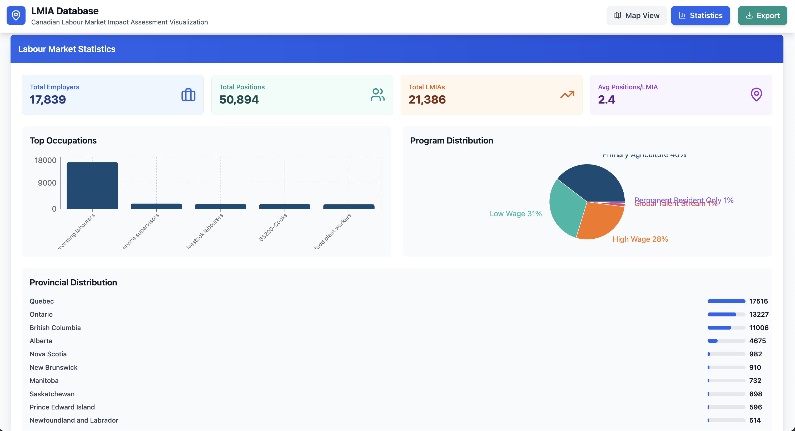

# 🇨🇦 LMIA Database: Canadian Labour Market Impact Assessment Visualization

<div align="center">


*A comprehensive visualization platform for Canadian Labour Market Impact Assessment (LMIA) data, featuring interactive maps, statistical analysis, and real-time data processing.*

[](https://reactjs.org/)
[](https://www.typescriptlang.org/)
[](https://leafletjs.com/)
[](https://vitejs.dev/)
[](LICENSE)

</div>

## Overview

The LMIA Database is a sophisticated web application designed to visualize and analyze Canadian Labour Market Impact Assessment data. Built with modern web technologies, it provides interactive mapping capabilities, comprehensive statistical analysis, and real-time data processing for over **17,000+ employers** across Canada.

### 🎯 Key Features

- **Interactive Mapping**: Real-time visualization of employer locations with advanced clustering
- **Statistical Dashboard**: Comprehensive analytics with charts and data visualizations  
- **High Performance**: Optimized for handling large datasets with Web Workers and server-side processing
- **Advanced Filtering**: Search and filter by location, occupation, program type, and time period
- **Responsive Design**: Modern, mobile-friendly interface built with Tailwind CSS
- **Real-time Updates**: Dynamic data loading with viewport-based optimization

## Screenshots

### Interactive Map View


*Interactive map showing clustered employer data across Canada with real-time performance metrics*

### Statistical Dashboard


*Comprehensive statistics dashboard featuring labor market analytics, occupation distributions, and provincial breakdowns*

## Quick Start

### Prerequisites

- **Node.js** (v18 or higher)
- **npm** or **yarn**
- **Git**

### Installation

1. **Clone the repository**

   ```bash
   git clone https://github.com/yourusername/can-lmia.git
   cd can-lmia
   ```

2. **Install dependencies**

   ```bash
   npm install
   ```

3. **Start the development servers**

   ```bash
   # Terminal 1: Start the backend server
   node server.js
   
   # Terminal 2: Start the frontend development server
   npm run dev
   ```

4. **Access the application**

   - Frontend: [PORT 5173](http://localhost:5173)
   - Backend API: [PORT 3001](http://localhost:3001)

## Architecture

### Frontend Stack

- **React 18** with TypeScript for type-safe development
- **Vite** for fast development and optimized builds
- **Leaflet** with React-Leaflet for interactive mapping
- **Tailwind CSS** for responsive, utility-first styling
- **Recharts** for data visualization and analytics
- **React Router** for client-side routing

### Backend Stack

- **Node.js** with Express.js for API server
- **XLSX** for Excel file processing
- **CORS** enabled for cross-origin requests

### Performance Optimizations

- **Web Workers** for background clustering calculations
- **Server-side clustering** for efficient data processing
- **Viewport-based filtering** to load only visible data
- **Chunked loading** to prevent UI blocking
- **Canvas rendering** for high-performance marker display

## Project Structure

```text
can-lmia/
├── public/
│   └── data/
│       └── LMIA-DATA/           # Excel data files by year/quarter
├── src/
│   ├── components/              # React components
│   │   ├── ComprehensiveMapView.tsx
│   │   ├── ChunkedMarkerLoader.tsx
│   │   ├── CanvasMarkerRenderer.tsx
│   │   ├── HeatmapRenderer.tsx
│   │   └── StatisticsPanel.tsx
│   ├── hooks/                   # Custom React hooks
│   │   ├── useEmployerData.ts
│   │   └── useClusteringWorker.ts
│   ├── data/                    # Data processing modules
│   │   ├── comprehensiveDataLoader.ts
│   │   └── serverDataLoader.ts
│   ├── workers/                 # Web Workers
│   │   └── clusteringWorker.ts
│   ├── types/                   # TypeScript type definitions
│   │   └── lmia.ts
│   └── pages/                   # Page components
│       ├── MapPage.tsx
│       └── StatisticsPage.tsx
├── server.js                    # Express.js backend server
└── package.json
```

## Configuration

### Environment Variables

Create a `.env` file in the root directory:

```env
# Server Configuration
PORT=3001
NODE_ENV=development

# Data Configuration
DATA_PATH=./public/data/LMIA-DATA
```

### API Endpoints

| Endpoint | Method | Description |
|----------|--------|-------------|
| `/api/health` | GET | Server health check |
| `/api/employers` | GET | Get filtered employer data |
| `/api/available-data` | GET | Get available years/quarters |

## Data Sources

The application processes Canadian Labour Market Impact Assessment data from official government sources:

- **Format**: Excel (.xlsx) files
- **Coverage**: 2015-2025 (quarterly data)
- **Records**: 17,839+ employers
- **Fields**: Employer details, locations, positions, programs, occupations

### Data Processing Pipeline

1. **Excel Parsing**: XLSX library processes government Excel files
2. **Geocoding**: Address-to-coordinates conversion for mapping
3. **Clustering**: Server-side clustering for performance optimization
4. **API Serving**: RESTful endpoints with viewport filtering

## Features Deep Dive

### Interactive Mapping

- **Multi-level Clustering**: Automatic clustering based on zoom level
- **Performance Optimization**: Web Workers handle clustering calculations
- **Real-time Filtering**: Viewport-based data loading
- **Custom Markers**: Program-specific marker styling and colors

### Statistical Analysis

- **Labor Market Metrics**: Total employers, positions, and LMIAs
- **Geographic Distribution**: Provincial and territorial breakdowns
- **Occupation Analysis**: Top occupations and program distributions
- **Time Series Data**: Quarterly and annual trends

### Performance Features

- **Server-side Processing**: Efficient data clustering and filtering
- **Web Workers**: Background processing without UI blocking
- **Chunked Loading**: Progressive data loading for large datasets
- **Canvas Rendering**: High-performance marker rendering
- **Viewport Optimization**: Load only visible data

## Deployment

### Production Build

```bash
# Build the frontend
npm run build

# Start production server
npm start
```

### Docker Deployment

```dockerfile
FROM node:18-alpine

WORKDIR /app
COPY package*.json ./
RUN npm ci --only=production

COPY . .
RUN npm run build

EXPOSE 3001
CMD ["npm", "start"]
```

## Contributing

We welcome contributions! Please follow these steps:

1. **Fork the repository**
2. **Create a feature branch**: `git checkout -b feature/amazing-feature`
3. **Commit your changes**: `git commit -m 'Add amazing feature'`
4. **Push to the branch**: `git push origin feature/amazing-feature`
5. **Open a Pull Request**

### Development Guidelines

- Follow TypeScript best practices
- Use ESLint and Prettier for code formatting
- Write meaningful commit messages
- Add tests for new features
- Update documentation as needed

## License

This project is licensed under the MIT License - see the [LICENSE](LICENSE) file for details.

## Acknowledgments

- **Government of Canada** for providing LMIA data
- **Leaflet** community for excellent mapping tools
- **React** team for the amazing framework
- **OpenStreetMap** contributors for map data

## Support

For support, [email](info@deadcoast.net) or create an issue in this repository.

---

<div align="center">

[Report Bug](https://github.com/yourusername/can-lmia/issues) · [Request Feature](https://github.com/yourusername/can-lmia/issues) · [Documentation](https://github.com/yourusername/can-lmia/wiki)

</div>
